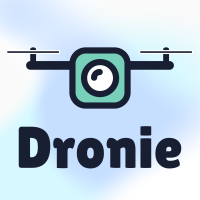

<!-- <h1 style="text-align: center"> Dronie </h1> -->

<h2 style="text-align: center"> Front End </h2>

---  

<h3 style="text-align: center"> Welcome to Dronie </h3>

#### Table of Contents 
* [About](#about)
* [General Usage](#general-usage)
* [Running the App Locally](#running-the-app)
* [Contributing](#contributing)

#### About

Dronie was developed as the Flatiron School Software Engineering capstone project by Daniel Sasse. The client interface of this app is built with React functional components and utilizes the Ionic Framework in order to leverage Ionic's cross-deployment abilities as a web-app and native iOS and Android apps. Redux is incorporated for global state managment across the app, and custom Styled and Ionic components were used for styling. Javascript Web Tokens are used to monitor authentication for all routes and actions.

The client interface connects to a Rails API server which is used to persist data to a PostgreSQL database and to manage websockets for the live chat system through ActionCable and Redis. The client interface also connects to the Cloudinary API to upload and retrieve image content. The repo link for the Rails API server can be found [here]("https://github.com/dsasse07/dronie-backend")

[Back to Top](#table-of-contents)

#### General Usage
* __Authetication__ 
  * On the initial page load, users will be automatically authenticated using the token received from their previous login/registration unless they have manually logged out. If no token is present, the user must re-authenticate.

* __Home__
  * After authentication, the app will redirect to the main Post feed, sorted chronologically. This feed is built using an "infinite scroll" technique which retrieves five posts at a time and incrementally fetches more as the user scrolls. If the user is following any other users, a toggle button will be enabled to adjust the feed to posts only from the followed users.

* __Posts__
  *  Within each post, the user has the ability to like/unlike, view the tags the post was built with, view the comments on the post, and add a new comment. If a post belongs to a user, the will have the ability to delete that comment.
  * If a post belongs to a user, they will have the ability to permanently delete that post after confirmation.
  * clicking on any user avatar will take the user to the profile page of that user.

* __Profile page__
  * Dynamically loads the selected user and subsquently fetches their 12 most recent posts as previews. This page incorporates a similar infinite scroll component to the home page, and more previews will be fetched as the user scrolls if more exist.
  * If the profile page is of the current user, a menu button will be available for editting ones profile, logging out, or deleting the account. If the profile page is of another user, buttons will be available to follow/unfollow the user, or to send them a direct message.

* __New Post page__
  * Utilizes a file drop zone for image uploading, and a custom built tag selector to suggest existing tags to the user as they type. All posts must have at least 1 image, but no more than 4 in order to post.

* __Search Page__
  * Offers the ability to search for specific users, or terms present in post tags, post locations, or post decriptions and accepts partial text matches

* __Messages__
  * The initial contacts page is sorted with most recent contacts first, and then other "friends" second. Friends are defined by users that mutually follow each other. The search bar the the top enables users to filter both of these lists to quickly find a specific user.
  * Messages will update live. Users will be notified of unread messages on the messages button at the bottom of the page. While viewing the messages page, individual unread message count for each conversation will appear next to the user, and an excerpt of the most recent message between the two users will be displayed as well. Once the recipient of a message open the chat with the user, those unread messages will be marked as read and the send will be notified that it has been viewed.

[Back to Top](#table-of-contents)

#### Running the App

* To run locally :
  * run `npm install -g @ionic/cli` to install the Ionic CLI needed to control the app
  * run `npm install` to install app dependencies
  * run `ionic serve` to start a local server for the frontend
    * The url for the backend server must be saved into your `.env.development.local` from with the variable name `REACT_APP_BACKEND`
    * Ex: `REACT_APP_BACKENDL="http://localhost:3001"`
    * The url for the websocket server must be saved into your `.env.development.local` from with the variable name `REACT_APP_SOCKET `
    * Ex: `REACT_APP_SOCKET="ws://localhost:3000"`
  * In order to connect to the Cloudinary API, you will need a Cloudinary account to gain access to a cloud name and upload preset. You can obtain those at the [Cloudinary console]("https://cloudinary.com/") after making an account.
    * Store these items in the `env.development.local` file with the variable name `REACT_APP_CLOUD_NAME` and `REACT_APP_UPLOAD_PRESET`

[Back to Top](#table-of-contents)

### Contributing
Pull requests are welcome. Please make sure that your PR is <a href="https://www.netlify.com/blog/2020/03/31/how-to-scope-down-prs/">well-scoped</a>. For major changes, please open an issue first to discuss what you would like to change.

#### Known issues
* <a href="https://github.com/dsasse07/dronie-frontend/issues">Visit Issues Section</a>

#### Contributors
<table>
  <tr>
    <td align="center"><a href="https://github.com/dsasse07"> <b>Daniel Sasse</b></a> 
    </tr>

[Back to Top](#table-of-contents)